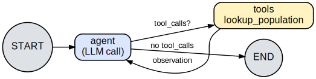
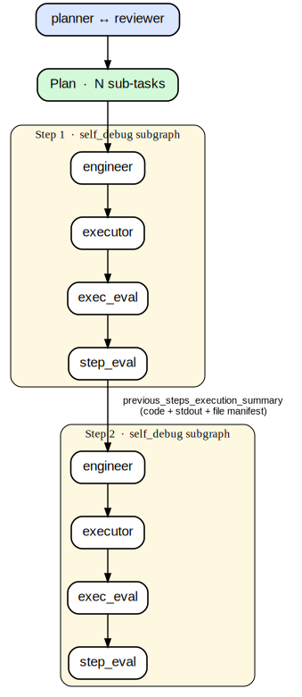

# Teaching ReAct with LangGraph

A 2-node graph, one tool, one knob that matters.

Boris Bolliet · 2026-05-27
`github.com/borisbolliet/cmbagent_lg`

---

# ReAct = Reasoning + Acting

Yao et al., 2022 — [arXiv:2210.03629](https://arxiv.org/abs/2210.03629).

The LLM alternates between:

- **Think** — natural-language reasoning about what to do next
- **Act** — call a tool with structured arguments
- **Observe** — receive the tool's result
- **Loop.**

Modern tool-calling models fold the *think* into the *act* step (the tool call message itself); the loop structure is unchanged.

---

# The loop, in one picture



LangGraph: **two nodes + one conditional edge.** The conditional edge *is* the loop.

---

# Code: the tool and the two nodes

```python
@tool
def lookup_population(country: str) -> str:
    """Look up a country's population in a small reference table."""
    return f"The population of {country} is {POPULATIONS[country]:,}."

def agent_node(state):
    return {"messages": [model.invoke(state["messages"])]}

def tool_node(state):
    last = state["messages"][-1]
    outs = []
    for tc in last.tool_calls:
        outs.append(ToolMessage(
            content=lookup_population.invoke(tc["args"]),
            tool_call_id=tc["id"],
        ))
    return {"messages": outs}
```

---

# Code: wiring the graph

```python
def should_continue(state):
    last = state["messages"][-1]
    return "tools" if last.tool_calls else END

g = StateGraph(State)
g.add_node("agent", agent_node)
g.add_node("tools", tool_node)
g.add_edge(START, "agent")
g.add_conditional_edges(
    "agent", should_continue,
    {"tools": "tools", END: END},
)
g.add_edge("tools", "agent")
graph = g.compile()
```

That's the whole agent.

---

# Live demo: one full trace

```
[0] Human   What is the population of France?

[1] AI      → tool_call: lookup_population({"country": "France"})

[2] Tool    The population of France is 68,000,000.

[3] AI      The population of France is approximately 68,000,000.
```

Four messages. One pass around the loop. The conditional edge fired **exit** on message [3] because it had no `tool_calls`.

---

# The knobs (hyperparameters)

**Loop control**
`recursion_limit` (default 25) · termination condition · `parallel_tool_calls` · per-tool timeout · total budget

**LLM**
model · **temperature** · max_tokens · **system prompt** · **tool descriptions** *(de facto prompt)*

**Tools**
tool count *(~10–15 max before selection degrades)* · arg schema strictness · error policy · retry policy

**Memory**
full history vs sliding window vs summary · checkpointer for resume / human-in-the-loop

---

# Temperature finding — does it matter?

`gemini-3.1-flash-lite` · permissive system prompt · 3 reps × N = 10

| | rep 1 | rep 2 | rep 3 | mean |
|---|---|---|---|---|
| **T = 0.0** | 100 % | 100 % | 100 % | **100 %** |
| **T = 1.0** |  50 % |  40 % |  60 % |  **~50 %** |

(% = tool-call rate)

At **T = 0** the model deterministically uses the tool every time.
At **T = 1** it sometimes answers from priors — visibly halves tool use.

---

# Why it's subtle: the system-prompt interaction

First attempt: temperature did **nothing**. Why?

| System prompt | T = 0 | T = 1 |
|---|---|---|
| *(none)* | 100 % | 100 % |
| "Use this tool for any population question" *(prescriptive)* | 100 % | 100 % |
| "Only call the tool when uncertain" *(permissive)* | 100 % | ~50 % |

> Temperature does **nothing visible** until the model has real discretion.
> The tool description and system prompt dominate.

---

# Beyond one step: `deep_research`

A single ReAct loop = one *step*.

For a multi-step task, wrap each step in its own ReAct loop and **thread results between them**:

- **planner** produces a `Plan` (N sub-tasks)
- **deep_research_graph** iterates: each step is a fresh self-debug subgraph
- pass `previous_steps_execution_summary` — prior code + stdout + workspace file manifest — into the next step's engineer prompt

The cross-step carryover is the whole point.

---

# `deep_research` demo

**Task**: generate noisy `sin(x)`, save it, then load and plot it.



Both steps OK on first attempt · ~17 s · `examples/run_deep_research_simple.py`.

---

# Recap

- **ReAct** = 2 nodes + 1 conditional edge. The edge *is* the loop.
- Tool-using agents → almost always **temperature 0**, *but only because* tool description and system prompt frame a real choice.
- **`deep_research`** = one ReAct loop per step + cross-step carryover.

**Code**
- `examples/react_demo.py`
- `examples/run_deep_research_simple.py`

**Reference**
Yao et al., *ReAct: Synergizing Reasoning and Acting in Language Models*, [arXiv:2210.03629](https://arxiv.org/abs/2210.03629).
LangGraph: [`create_react_agent` reference](https://reference.langchain.com/python/langgraph.prebuilt/chat_agent_executor/create_react_agent).
